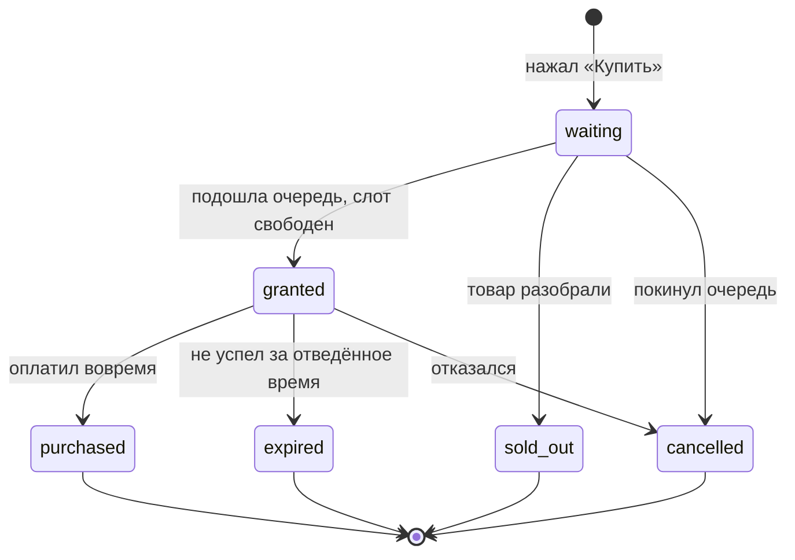

# Требования · Авито Очередь

Команда 33 «Dream Team» · кейс 2

Источник истины по объёму работ. Изменения через PR. Отслеживание статуса в GitHub Issues, каждый issue ссылается на ID требования.
 
---

## 1. Бизнес-цель

Спрос на дефицитный товар превышает предложение. Несколько покупателей одновременно доходят до оплаты, заказов оформляется больше, чем есть товара. Пользователь тратит время и в конце узнаёт, что товар недоступен - это воспринимается как несправедливость и снижает лояльность.

Решение: пользовательская очередь перед чекаутом. Система упорядочивает претендентов, выдаёт временное персональное право на покупку и следит, чтобы неоплаченная покупка не блокировала товар бесконечно.

**Центральная механика - не очередь, а право на покупку.** Оно должно быть временным, персональным, защищённым, непередаваемым и одноразовым.
 
---

## 2. Границы MVP

Считается уже существующим и не реализуется: регистрация и авторизация, полноценное оформление заказа, оплата, списание стоков после успешной оплаты.

PS: личность пользователя всё равно нужна, чтобы привязать к нему право на покупку. Можно реализовать переключеталем тестовых аккаунтов, без настоящей авторизации.
 
---

## 3. Основной сценарий

1. Пользователь открывает каталог и выбирает лимитированный товар
2. Нажимает «Купить» → попадает в очередь, видит свою позицию и объяснение происходящего
3. Система по мере освобождения слотов выдаёт права на покупку в порядке очереди
4. Получив право, пользователь видит таймер и кнопку перехода к покупке
5. Успел оплатить → покупка завершена
6. Не успел → право сгорает, слот возвращается в очередь и уходит следующему
7. Товар закончился, пока пользователь ждал → сообщение и предложение альтернатив
---

## 4. Состояния участия

Записи не удаляются, меняется поле `status`. Каждое состояние обязано иметь сообщение для пользователя и следующий шаг.

| Состояние | Что видит пользователь | Следующий шаг |
|---|---|---|
| `waiting` | Позиция в очереди, объяснение | Ждать, либо покинуть очередь |
| `granted` | Таймер обратного отсчёта | Перейти к покупке |
| `purchased` | Подтверждение покупки | Вернуться в каталог |
| `expired` | Время вышло, право сгорело | Встать в очередь заново |
| `sold_out` | Товар закончился | Посмотреть похожие лоты |
| `cancelled` | Вы покинули очередь | Вернуться к товару |
 
---

## 5. Функциональные требования

### Must - необходимо 100% успеть. Дедлайн четверг-пятница 

**Каталог**

| ID | Требование |
|---|---|
| CAT-01 | Список лимитированных товаров с названием, ценой, остатком |
| CAT-02 | Минимум один товар с остатком 1 единица — для демонстрации конкуренции |
| CAT-03 | Карточка товара с кнопкой «Купить» |
| CAT-04 | Переключение тестового пользователя без авторизации |

**Очередь**

| ID | Требование |
|---|---|
| QUE-01 | Постановка в очередь по нажатию кнопки |
| QUE-02 | Идемпотентность: повторное нажатие не создаёт вторую запись для той же пары пользователь-товар |
| QUE-03 | Порядок очереди — FIFO по времени постановки |
| QUE-04 | Позиция вычисляется при запросе, а не хранится |
| QUE-05 | Экран ожидания: позиция, статус, объяснение происходящего |
| QUE-06 | Продвижение очереди: гашение истёкших прав и выдача новых происходит в одной транзакции с запросом статуса от ожидающих |

**Право на покупку**

| ID | Требование |
|---|---|
| RGT-01 | Выдача права атомарна: число активных прав никогда не превышает числа доступных единиц |
| RGT-02 | Право временное, срок хранится полем `expires_at` в БД |
| RGT-03 | Право персональное — привязано к паре `user_id` + `item_id` |
| RGT-04 | Право одноразовое: использованное повторно не принимается |
| RGT-05 | Право непередаваемое: другой пользователь не может им воспользоваться, даже получив токен |
| RGT-06 | При истечении права слот возвращается в пул и уходит следующему в очереди |
| RGT-07 | Гонка «истечение против покупки» разрешается в одной транзакции: одновременная попытка оплаты и истечения не может привести к двойной продаже |

**Чекаут**

| ID | Требование |
|---|---|
| CHK-01 | Вход в чекаут проверяет наличие активного права именно на этот товар |
| CHK-02 | Обход очереди невозможен: прямой переход по URL без права отклоняется |
| CHK-03 | Заглушка оплаты с результатом «успех» |
| CHK-04 | После успешной оплаты право помечается использованным, участие переходит в `purchased` |

**Инфраструктура и оформление**

| ID | Требование |
|---|---|
| INF-01 | Единый репозиторий: frontend + backend |
| INF-02 | Приложение поднимается одной командой через Docker Compose |
| INF-03 | `.golangci.yaml` в корне проекта |
| INF-04 | ESLint + Prettier на фронтенде |
| INF-05 | Юнит-тесты доменной логики: переходы состояний, правила права |
| INF-06 | Тест на конкурентность: N параллельных претендентов на 1 единицу → ровно одно активное право |
| INF-07 | CI на PR: сборка, линтеры, `go test -race` |
| INF-08 | Проект развёрнут и доступен по публичной ссылке |
| INF-09 | README: запуск, зависимости, сценарии, API, ограничения MVP, ключевые решения |
| INF-10 | Обоснование выбора БД в README |
| INF-11 | Обоснование набора правил линтеров в README |
| INF-12 | Раздел об использовании нейросетей: на каких этапах и как |
| INF-13 | Описание спроектированного пользовательского пути и продуктовой логики |

### Should - после того, как все обязательные фичи полностью работают

| ID | Требование |
|---|---|
| S-01 | Панель-симулятор: запустить N виртуальных покупателей и увидеть распределение прав |
| S-02 | Нагрузочный тест как артефакт в репозитории, результаты в README |
| S-03 | Живое обновление позиции через SSE вместо опроса |
| S-04 | Оценка времени ожидания по скорости продвижения очереди |
| S-05 | Похожие лоты у других продавцов при состоянии `sold_out` |
| S-06 | Возможность покинуть очередь |
| S-07 | Дашборд метрик: длина очереди, среднее ожидание, конверсия права в покупку |

### Could - в самом конце только если останется время

| ID | Требование |
|---|---|
| C-01 | Приоритеты в очереди с продуктовым обоснованием |
| C-02 | Ограничение частоты постановки, защита от ботов |
| C-03 | Уведомление «ваша очередь подошла» |
| C-04 | Структурные логи и базовые метрики |
| C-05 | Адаптивная вёрстка |
| C-06 | ИИ-предсказание времени ожидания |
| C-07 | ИИ-рекомендации альтернативного товара |

### Won't - сознательно не делаем

Реальная авторизация · реальная оплата · списание стоков · полноценное оформление заказа · микросервисы
 
---

## 6. Нефункциональные требования

| ID | Требование                                                                              |
|---|-----------------------------------------------------------------------------------------|
| NFR-01 | Корректность важнее производительности: при конфликте выбирается более строгая изоляция |
| NFR-02 | Ответ API на пользовательских операциях - до 300-400 мс на MVP-нагрузке                 |
| NFR-03 | Один источник истины: всё состояние в PostgreSQL                                        |
| NFR-04 | Отсутствие фоновых воркеров: продвижение очереди синхронно                              |
| NFR-05 | Пользователь никогда не видит «серую зону» - у каждого состояния есть текст             |
| NFR-06 | Проект запускается посторонним человеком по README без устных пояснений                 |
 
---

## 7. Критерии приёмки

Проверяются перед сдачей. Основа для приёмочного тестирования.

| # | Сценарий | Ожидаемый результат |
|---|---|---|
| A-01 | Один пользователь, товар в наличии | Получает право сразу, доходит до покупки |
| A-02 | Двое на 1 единицу | Право у одного, второй ждёт с корректной позицией |
| A-03 | Держатель права не оплачивает | Право сгорает, слот уходит второму |
| A-04 | 100 параллельных запросов на 1 единицу | Ровно одно активное право, одна продажа, никто не завис |
| A-05 | Переход в чекаут без права по прямой ссылке | Отклонено с понятным сообщением |
| A-06 | Токен права передан другому пользователю | Отклонено |
| A-07 | Повторное использование уже потраченного права | Отклонено |
| A-08 | Тройное нажатие «Купить» из трёх вкладок | Одна запись в очереди |
| A-09 | Товар разобран, пока пользователь ждал | Состояние `sold_out` с предложением альтернатив |
| A-10 | Попытка оплаты ровно в момент истечения права | Один исход: либо покупка, либо истечение. Двойной продажи нет |
| A-11 | Запуск проекта с нуля по README на чистой машине | Поднимается одной командой |
 
---

## 8. Соответствие критериям жюри

| Критерий | Чем закрывается |
|---|---|
| Обязательная бизнес-логика | Основной сценарий, все состояния из раздела 4, приёмка A-01…A-10 |
| Доп. функционал | Should-блок, в первую очередь S-01, S-05 |
| README | INF-09…INF-13 |
| Тесты | INF-05, INF-06, `-race` в CI |
| Линтеры | INF-03, INF-04, INF-11 |
| Дизайн и архитектура | Разделение по пакетам, чистый домен без зависимостей от инфраструктуры |
| Продуктовые решения | INF-13, раздел 4 с обоснованием состояний, S-05 |
| Чистота кода | INF-07, единый формат, отсутствие мёртвого кода |
| Доступность в интернете | INF-08 |
 
---

## 9. Стек и ключевые решения

**Backend:** Go · chi · pgx · миграции goose  
**Frontend:** 
**База:** PostgreSQL
**Запуск:** Docker Compose

**Почему одна БД.** Суть задачи - атомарная выдача ограниченного ресурса. Это требует транзакций и блокировок строк, которые Postgres предоставляет напрямую. Второе хранилище создало бы распределённую транзакцию и второй источник истины при том, что нагрузка MVP этого не требует.

**Почему не Redis для срока жизни права.** Истечение права имеет побочный эффект - слот должен вернуться в пул и уйти следующему. Это транзакция в основной БД. Уведомления об истечении ключей в Redis доставляются без гарантий: потерянное при перезапуске событие означает навсегда заблокированный слот. Срок жизни хранится колонкой `expires_at`, право считается активным при `status = 'active' AND expires_at > now()`.

**Почему не микросервисы.** Разделение каталога и очереди по сервисам с отдельными базами превратило бы локальную транзакцию в распределённую, то есть создало бы ровно ту проблему, которую задача просит решить. Разделение по зонам ответственности достигается пакетами внутри монолита.

**Почему опрос, а не WebSockets.** Поток данных односторонний и низкочастотный. Опрос раз в секунду проще, надёжнее и не зависит от настроек прокси. SSE рассматривается как улучшение после закрытия обязательного объёма.
 